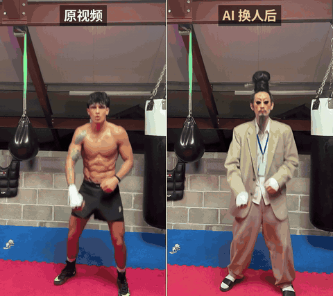

# AI 角色换人爆款

**不再自己拍爆款，而是挑已经火了的视频，把里面的人换成你的 AI 角色。**

一个 Claude Skill：设计原创角色、生成设定图、调用 Seedance 2.5 换人、自动做对比视频、顺手写好发布文案。

▶️ [完整对比视频（15 秒，带原声）](examples/wen-xiansheng-compare.mp4)

> 示例角色"闻先生"：明朝书生的脑袋，打工人的身子。巨大的发髻横插玉簪，大两号的西装，白袜配拖鞋。原视频里的拳手被换掉了，动作一帧没改。

---

## 它能做什么

- **设计角色**：按"夸张长在人身上，而不是穿在身上"的原则，给出原创角色方案和设定图提示词
- **角色档案**：把设定图、正脸照和外貌描述存成档案，每次换人都调用同一份，角色不走样
- **检查视频**：自动报告分辨率和时长，像素不够就自动放大，生成预览图
- **自动写提示词**：支持一次换一个人或多个人，@图片 编号自动对齐
- **API 生成**：调用 Seedance 2.5（BytePlus ModelArk / 火山方舟），自动提交、轮询、下载
- **对比视频**：左边原视频、右边换人后，带标签、无黑边
- **发布文案**：TikTok/IG 字幕建议，以及推特教程串推的写法

## 文件说明

| 文件 | 说明 |
|---|---|
| [`skills/ai-character-swap/SKILL.md`](skills/ai-character-swap/SKILL.md) | Skill 本体，给 Claude 用 |
| [`skills/ai-character-swap/scripts/seedance_swap.py`](skills/ai-character-swap/scripts/seedance_swap.py) | 配套脚本（SKILL.md 末尾也附了一份），只依赖 Python 3 和 ffmpeg |
| [`新手说明.md`](新手说明.md) | 给不会命令行的人看的说明，包含零门槛的网页版做法 |
| [`examples/`](examples/) | 示例对比视频 |

## 怎么用

**不会写代码**：直接看 [新手说明](新手说明.md) 的"做法一：网页版"，用 ChatGPT 加 Seedance 网页版就能做。

**交给 Claude 自动跑**：
1. 安装 ffmpeg（Mac：`brew install ffmpeg`；Windows：`winget install ffmpeg`）
2. 开通 Seedance 2.5 API，创建 API Key，设置环境变量 `ARK_API_KEY`
3. 把 `skills/ai-character-swap/` 添加为 Claude 的 Skill
4. 在自己的电脑上，把角色图和要换的视频发给 Claude，说"用 XX 换掉视频里的那个人"

## 两条底线

- **角色必须原创**：不要用明星、网红或身边人的照片做角色，平台会拦截，也有肖像权问题
- **发布时打开 AI 标签**：TikTok 和 IG 发帖时都要标注 AI 生成内容

## 状态

- 视频检查、提示词生成、对比视频这几步已经用示例素材测试通过
- API 调用部分的请求格式依据 BytePlus 官方给 ComfyUI 的 Seedance 2.5 接入代码整理，第一次使用请先 `--dry-run`，再拿一条短视频试跑。遇到问题欢迎提 Issue

---

作者：[@DDJCXX 硅基废话](https://x.com/DDJCXX)
